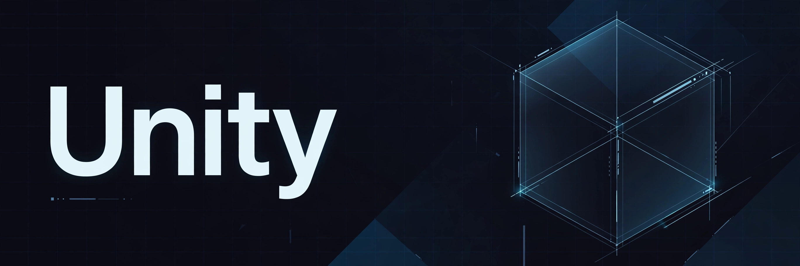

# Unity

> ## Status: 🟡 In Progress
>
> <progress value="10" max="100"></progress>
>
> **Progress: 10%** — Empty Unity project skeleton: settings and one editor helper script, no scenes or gameplay.

<p align="center">
  
</p>

 

## What it is

A fresh, nearly empty Unity project — just the generated `ProjectSettings/` scaffolding and a single editor helper script. There are no scenes, no gameplay scripts, no assets and no prefabs. It reads like the very first commit of a new Unity project ("Initial check-in"), waiting for its first scene.

## What works (verified)

Verified by listing the full file tree (checked 2026-10-08):

- ✅ Project skeleton is sane — `Assets/`, `Packages/`, `ProjectSettings/` present with valid Unity-format `.asset` files
- ✅ `Assets/Editor/HubForceResolve.cs` — an `[InitializeOnLoad]` editor script that resolves packages once, then self-deletes (verified by reading the code)
- ✅ Package manifest (`Packages/manifest.json`) declares the project's UPM dependencies
- ❌ No scenes (`*.unity`), no gameplay code, no tests, no CI workflows

Note: `ProjectSettings/ProjectVersion.txt` reports `UnknownUnityVersion`, so the exact Unity editor version this was created with isn't recorded — expect Unity to ask you to pick a version on first open.

## Tech stack

| Layer | Technology |
|---|---|
| Engine | Unity (version unknown — see note above) |
| Language | C# |
| Packages | Unity Package Manager (`Packages/manifest.json`) |

## How to run

Open the folder in Unity Hub and pick an editor version (not tested in this audit — there is nothing playable to run yet):

```sh
# In Unity Hub → Add → select this folder → open with any recent Unity LTS
```

## Screenshots

None — there is nothing to show yet. The banner above is the only visual.

## What you can add more

- [ ] **First scene** — add a `Scenes/` folder and a basic sample scene
- [ ] **Gameplay scripts** — the actual game this project is meant to become
- [ ] **Record the Unity version** — fix `ProjectVersion.txt` after opening so collaborators get the right editor
- [ ] **`.gitignore` coverage** — the file exists; confirm `Library/`, `Temp/`, `obj/` stay untracked
- [ ] **CI** — a Unity build/test workflow once there is something to build

## Project structure

```
Unity/
├── Assets/
│   └── Editor/
│       └── HubForceResolve.cs   # One-shot editor script: resolves packages, then self-deletes
├── Packages/
│   ├── manifest.json            # UPM package dependencies
│   └── packages-lock.json
└── ProjectSettings/             # Standard Unity project settings (.asset files)
```

---
*README written after code audit on 2026-10-08.*
